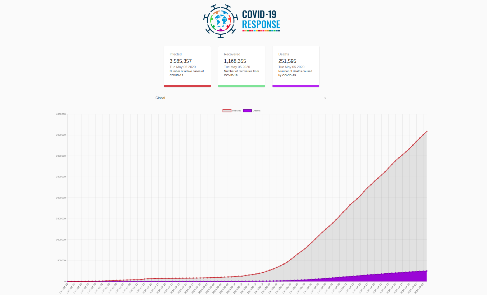
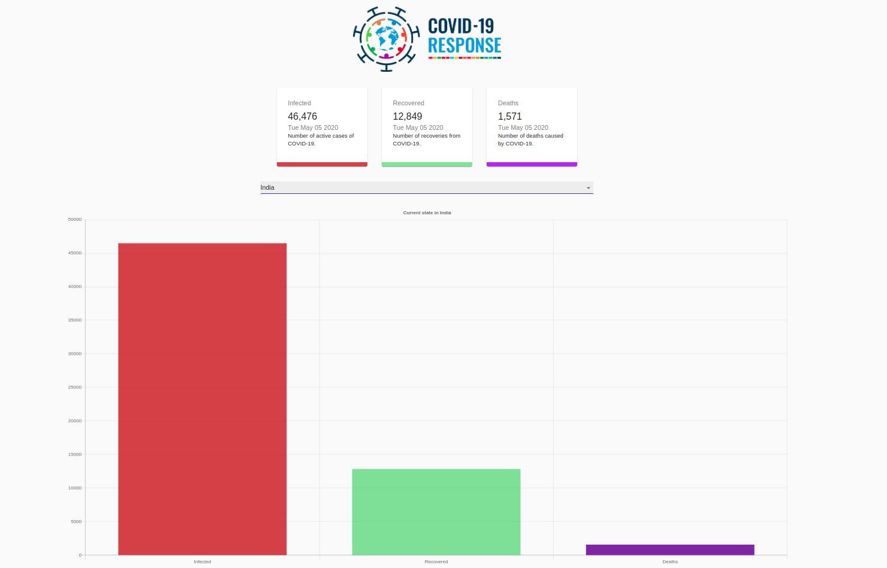
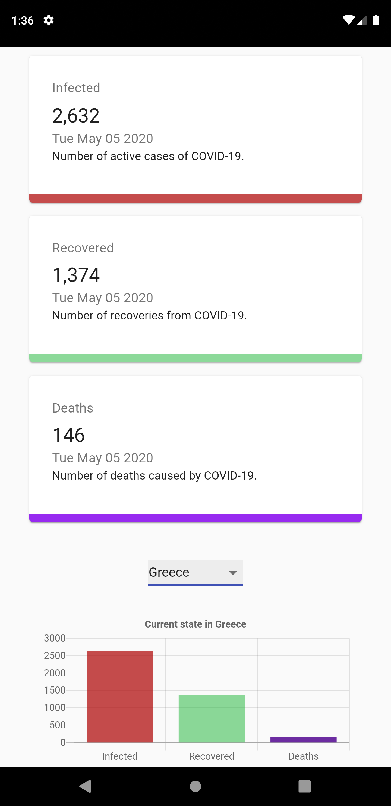
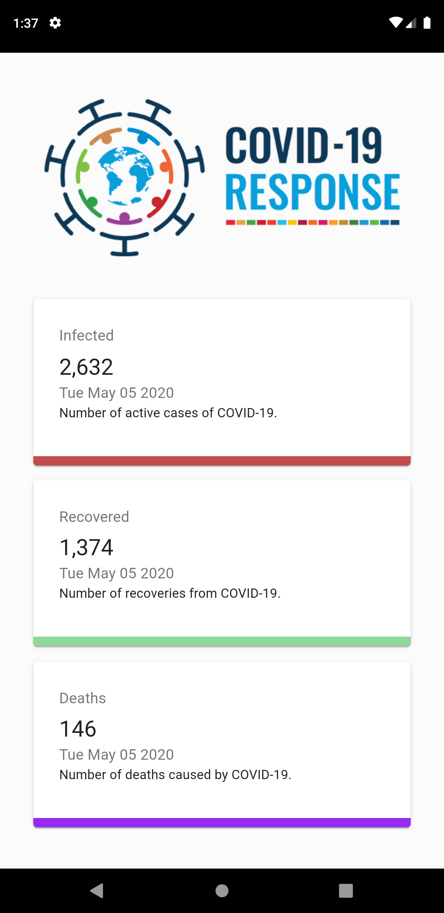

# COVID_onLooker

An application that can be used by every individual to keep a track of all the details of World Death, Infected and Recovered People globally. The details of the Coronavirus Pandemic has been fetched using the API https://covid19.mathdro.id/api. 

This Covid-19 tracker also works as a Progressive Web App containing Line and Bar Graph visuals made using react-chartjs-2 library, a Drop Down Menu to check the data of any Country and it can also be added to Home Screen of our Mobile App.

The Application is hosted at : [https://covid-19-tracker-zeta.vercel.app/] 

## Tools used: 

ReactJs.

## Desktop View of the Application
 
 

## Mobile View Of the Application

